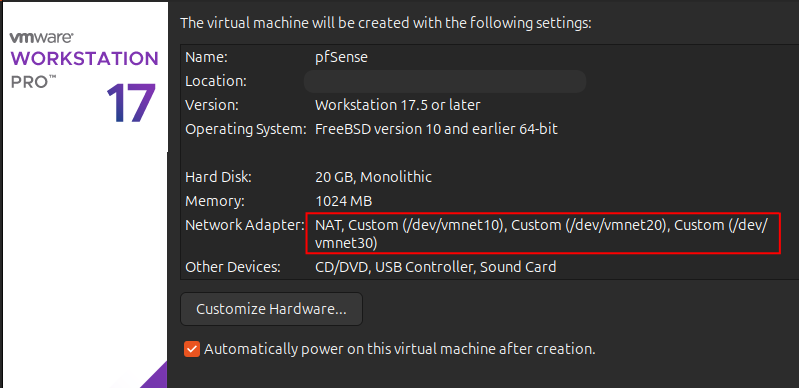
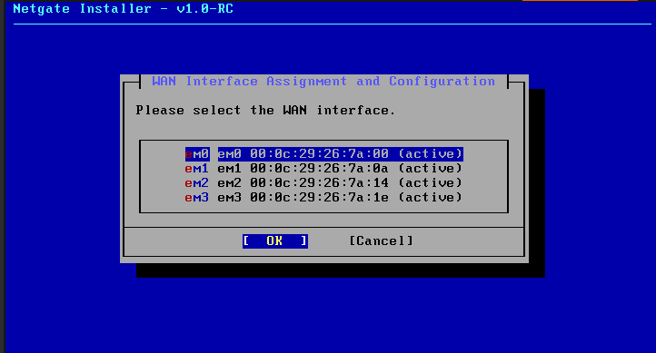
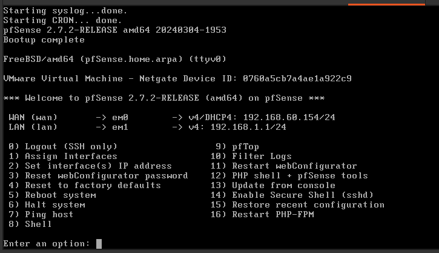

# pfSense Setup

---

### Step 0: Set up the NICs needed for the lab in Vmware

- Open Vmware > Edit > Virtual Network Editor
- Creating the 3 NICs for the lab as follows:
	- vmnet10 - Red - 192.168.10.0/24
	- vmnet20 - Blue - 192.168.20.0/24
	- vmnet30 - Purple - 192.168.30.0/24

- Vmnet8 (NAT) will be used for pfSense WAN
- the 3 other NICs are set to HOST ONLY to isolate them from the scary interwebs
- All other NICs will have DHCP switched on in Vmware (pfSense will manage this)

**Note the Settings:**
- Host-only (checked) keep the machines on this subnet isolated
- DHCP (unchecked) pfSense will manage this
- Connect a host virtual adapter (unchecked) only pfSense will be able to communicate with the Vms

---

### Step 1: Building the pfSense Vm

- In Vmware File > New Virtual Machine 
- Select Custom on the first screen of the wizard to have better control of the set up with multiple NICs
- Select Browse and find your ISO for the pfSense VM

	- To download -> [Download pfSense](https://www.pfsense.org/download/)

- Give it a name (something clever like pfSense maybe?)
- 1 processor and 1GB of RAM should be enough to run pfSense (can always change later if needed)
- Click through the defaults until you get to the Disk Space screen
	- Allocate 20GB (8GB is the min, but it's really not useful for collecting logs etc.)
	- Select "Store virtual disk as a single file"

**Don't Click Finish Just Yet**
When you get to the last screen of the wizard, select "Customize Hardware" to add the other NICs

Nics added:

Now click **Finish** and the VM will fire up

### pfSense Install Options

- Select Install (obviously)
- When this screen pops up, note the 4 interfaces that it sees; the added NICs from earlier
- Select **em0** -- This is for the WAN connection

Since we're using the free version, select **Install CE** (Community Edition)
- just click through the defaults until it asks about the version to install -- use "Current Stable Release"
- Finally reboot -- after reboot we get the console:

---

**Now to Assign those interfaces**

On the console screen select [1] --> Assign Interfaces
- It'll go first through setting up VLANs, just hit enter to get through it 

### pfSense Interface Assignment Logic

In this lab, we assigned `em2` (connected to VMnet20) as the **LAN** interface. This makes the Blue network (internal clients) the default trusted segment.

**Why Blue = LAN?**
- pfSense applies special default rules to the LAN interface:
  - Allows all outbound traffic 
  - Enables Web UI access 
  - Simplifies DHCP setup
- It makes sense to treat the Blue network as the central internal zone 
- Red (attacker) and Purple (logging) were set as optional interfaces to allow more control.

**Final Interface Mapping:**

| Interface | pfSense Name | VMware Network | Purpose        |
|-----------|--------------|----------------|----------------|
| NIC 1     | em0          | VMnet8         | WAN (NAT)      |
| NIC 2     | em1          | VMnet10        | OPT1 (Red)     |
| NIC 3     | em2          | VMnet20        | LAN (Blue) ✅  |
| NIC 4     | em3          | VMnet30        | OPT2 (Purple)  |

**Note: I could have, and should have set the VLANs in a different order; Blue on 192.168.10.0, Purple on 192.168.20.0, and Red on 192.168.30.0. It would have made for a smoother/cleaner set up. 
A learning moment...**

---

### Assigning IP Addresses

